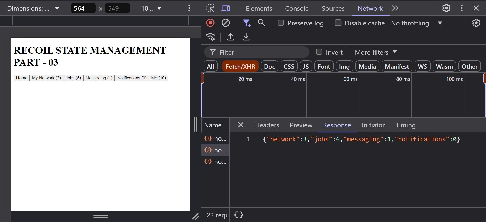
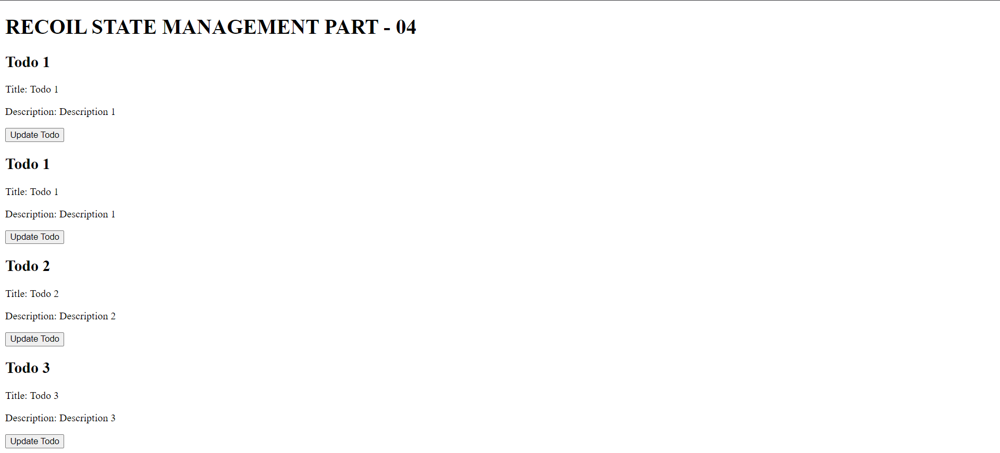
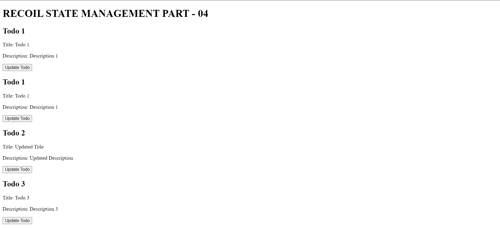
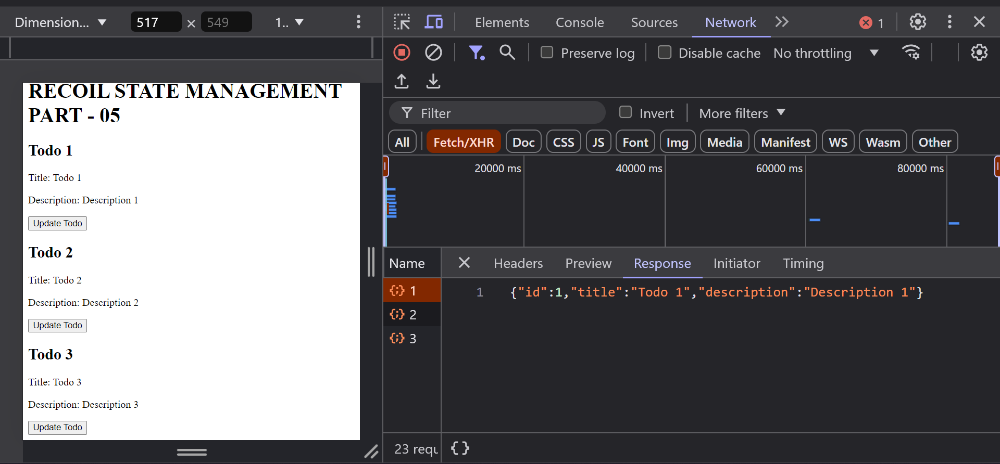
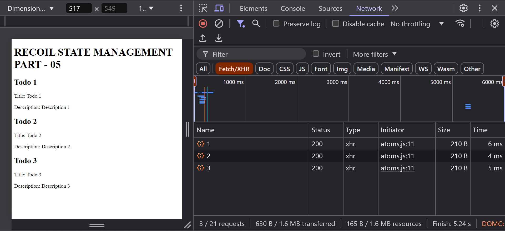

# Recoil State Management in React (Recoil Part 1)

Recoil is a state management library for React. It provides a simple and efficient way to manage state in a React application.

DOCS: https://recoiljs.org/docs/introduction/getting-started

## Installation

To install Recoil, run the following command:

```bash
npm install recoil
```

## Usage (Step 1)

We can use Recoil in React components by importing the `RecoilRoot` component from the `recoil` package:

```jsx
import { RecoilRoot } from "recoil";
```

**Why Recoil Root:**
Recoil Root is used to wrap the entire application in a single component. It provides a way to manage state in a React application.

## Create ATOMS (Step 2)

To create an atom, we can use the `atom` function from the `recoil` package:

```jsx
import { atom } from "recoil";

const myAtom = atom({
  key: "myAtom", // unique ID (with respect to other atoms/selectors)
  default: 0, // default value may be any type
});
```

**Why ATOMS:**
Atoms are used to store and manage state in a React application. It means an atom represents a piece of state.

## UseRecoilValue (Step 3)

To use an atom in a React component, we can use the `useRecoilValue` hook from the `recoil` package:

```jsx
import { useRecoilValue } from "recoil";

const MyComponent = () => {
  const value = useRecoilValue(myAtom);
  return <div>{value}</div>;
};
```

**Why UseRecoilValue:**
UseRecoilValue is used to read the value of an atom in a React component. It returns the current value of the atom.

## UseSetRecoilState (Step 4)

To use an atom in a React component, we can use the `useSetRecoilState` hook from the `recoil` package:

```jsx
import { useSetRecoilState } from "recoil";

const MyComponent = () => {
  const setCount = useSetRecoilState(myAtom);
  return <button onClick={() => setCount(count + 1)}>Increment</button>;
};
```

**Why UseSetRecoilState:**
UseSetRecoilState is used to update the value of an atom in a React component. It returns a function to update the value.

## UseRecoilState (Combination of Step 3 & 4)

To use an atom in a React component, we can use the `useRecoilState` hook from the `recoil` package:

```jsx
import { useRecoilState } from "recoil";

const MyComponent = () => {
  const [value, setValue] = useRecoilState(myAtom);
  return (
    <div>
      <p>{value}</p>
      <button onClick={() => setValue(value + 1)}>Increment</button>
    </div>
  );
};
```

**Why UseRecoilState:**
UseRecoilState is used to read and update the value of an atom in a React component. It returns the current value of the atom and a function to update the value.

# Recoil State Management in React (Recoil Part 2)

## Selectors ( Step 5 )

To create a selector, we can use the `selector` function from the `recoil` package:

```jsx
import { selector } from "recoil";

const mySelector = selector({
  key: "mySelector", // unique ID (with respect to other atoms/selectors)
  get: () => {
    // get function
  },
  set: (value) => {
    // set function
  },
});
```

**Why Selectors:**
Selectors are used to read the value of an `atom` or a `selector` in a React application. It means a selector represents a piece of state.

## UseRecoilValue (Step 6)

To use a selector in a React component, we can use the `useRecoilValue` hook from the `recoil` package:

```jsx
import { useRecoilValue } from "recoil";

const MyComponent = () => {
  const value = useRecoilValue(mySelector);
  return <div>{value}</div>;
};
```

**Why UseRecoilValue:**
UseRecoilValue is used to read the value of a selector in a React component. It returns the current value of the selector.

## UseSetRecoilState (Step 7)

To use a selector in a React component, we can use the `useSetRecoilState` hook from the `recoil` package:

```jsx
import { useSetRecoilState } from "recoil";

const MyComponent = () => {
  const setCount = useSetRecoilState(mySelector);
  return <button onClick={() => setCount(count + 1)}>Increment</button>;
};
```

**Why UseSetRecoilState:**
UseSetRecoilState is used to update the value of a selector in a React component. It returns a function to update the value.

## UseRecoilState (Combination of Step 6 & 7)

To use a selector in a React component, we can use the `useRecoilState` hook from the `recoil` package:

```jsx
import { useRecoilState } from "recoil";

const MyComponent = () => {
  const [value, setValue] = useRecoilState(mySelector);
  return (
    <div>
      <p>{value}</p>
      <button onClick={() => setValue(value + 1)}>Increment</button>
    </div>
  );
};
```

**Why UseRecoilState:**
UseRecoilState is used to read and update the value of a selector in a React component. It returns the current value of the selector and a function to update the value.

# Recoil State Management in React (Recoil Part 3)

## Asynchronous Data Queries

Asynchronous data queries are queries that fetch data from an external source, such as a server, database, or API.

## Implementing Asynchronous Data Queries ( Way 1 )

First create the simple `atom`:

```jsx
// RECOIL-STATE-MANAGEMENT/recoil-1/src/atoms.js
import { atom, selector } from "recoil";

export const notificationsAtom = atom({
  key: "networkAtom",
  default: {
    network: 4,
    jobs: 6,
    messaging: 3,
    notifications: 3,
  },
});

export const totalNotificationSelector = selector({
  key: "totalNotificationSelector",
  get: ({ get }) => {
    const {
      network,
      jobs,
      messaging,
      notifications: notificationss,
    } = get(notificationsAtom);
    return network + jobs + messaging + notificationss;
  },
});
```

Use the `atom` and `selector` in the `App` component:

```jsx
// RECOIL-STATE-MANAGEMENT/recoil-1/src/App.jsx
import {
  RecoilRoot as RecoilRootProvider,
  useRecoilState,
  useRecoilValue,
} from "recoil";
import { notificationsAtom, totalNotificationSelector } from "./atoms";
import { useEffect } from "react";
import axios from "axios";

const App = () => {
  return (
    <RecoilRootProvider>
      <MainApp />
    </RecoilRootProvider>
  );
};

const MainApp = () => {
  const [networkCount, setNetworkCount] = useRecoilState(notificationsAtom);
  const totalNotifications = useRecoilValue(totalNotificationSelector);

  const {
    network: networkValue,
    jobs: jobsValue,
    messaging: messagingValue,
    notifications: notificationsValue,
  } = networkCount;

  useEffect(() => {
    axios.get("http://localhost:3000/notifications").then((res) => {
      setNetworkCount(res.data);
    });
  }, [setNetworkCount]);

  return (
    <>
      <h1>RECOIL STATE MANAGEMENT PART - 03</h1>
      <div>
        <button>Home</button>

        <button>
          My Network ({networkValue >= 100 ? "99+" : networkValue})
        </button>
        <button>Jobs ({jobsValue})</button>
        <button>Messaging ({messagingValue})</button>
        <button>Notifications ({notificationsValue})</button>

        <button>Me ({totalNotifications})</button>
      </div>
    </>
  );
};

export default App;
```

## Screenshots



## Implementing Asynchronous Data Queries ( Way 2 )

Fisrt create the simple `atom`:

```jsx
// RECOIL-STATE-MANAGEMENT/recoil-1/src/atoms.js
import { atom, selector } from "recoil";
import axios from "axios";

// Notifications selector to fetch data (Asynchronous Data Query)
export const notificationsSelector = selector({
  key: "notificationsSelector",
  get: async () => {
    // Fetch data from the server
    const response = await axios.get("http://localhost:3000/notifications");
    return response.data;
  },
});

// Atom to hold notifications data
export const notificationsAtom = atom({
  key: "notificationsAtom",
  default: {
    network: 0,
    jobs: 0,
    messaging: 0,
    notifications: 0,
  },
});

// Selector to calculate total notifications
export const totalNotificationSelector = selector({
  key: "totalNotificationSelector",
  get: ({ get }) => {
    const {
      network,
      jobs,
      messaging,
      notifications: notificationss,
    } = get(notificationsAtom);
    return network + jobs + messaging + notificationss;
  },
});
```

Use the `atom` and `selector` in the `App` component:

```jsx
// RECOIL-STATE-MANAGEMENT/recoil-1/src/App.jsx
import { useEffect } from "react";
import {
  RecoilRoot as RecoilRootProvider,
  useRecoilState,
  useRecoilValue,
} from "recoil";
import {
  notificationsAtom,
  notificationsSelector,
  totalNotificationSelector,
} from "./atoms";

const App = () => {
  return (
    <RecoilRootProvider>
      <MainApp />
    </RecoilRootProvider>
  );
};

const MainApp = () => {
  const [networkCount, setNetworkCount] = useRecoilState(notificationsAtom);
  const totalNotifications = useRecoilValue(totalNotificationSelector);
  const fetchedNotifications = useRecoilValue(notificationsSelector);

  const {
    network: networkValue,
    jobs: jobsValue,
    messaging: messagingValue,
    notifications: notificationsValue,
  } = networkCount;

  // Set notifications only after the component has mounted
  useEffect(() => {
    // Set notifications
    if (fetchedNotifications) {
      setNetworkCount(fetchedNotifications);
    }
    // Return a cleanup function
    return () => {};
  }, [fetchedNotifications, setNetworkCount]);

  return (
    <>
      <h1>RECOIL STATE MANAGEMENT PART - 03</h1>
      <div>
        <button>Home</button>

        <button>
          My Network ({networkValue >= 100 ? "99+" : networkValue})
        </button>
        <button>Jobs ({jobsValue})</button>
        <button>Messaging ({messagingValue})</button>
        <button>Notifications ({notificationsValue})</button>

        <button>Me ({totalNotifications})</button>
      </div>
    </>
  );
};

export default App;
```

## Screenshots


# Recoil State Management in React (Recoil Part 4)

## AtomFamily

`atomFamily` in Recoil is a feature that allows we to create a family of atoms that can share the same structure/key but hold different values based on a parameter. This is particularly useful when we need to manage state for multiple similar items, such as a list of `todos` or `user profiles`.

**Problem:**
Some times we need more than one atom with the same key but different values for our use cases.

**For Example:**
Creating a todo list app, we need to create a todo atom for each todo item.

**Question:**
Create a component that takes a todo id as input and renders the todo item.

- We need to store the todo item in a todo atom with the todo id as the key. (Can't use useState)
- All todos can be hard coded as variables.

```jsx
// RECOIL-STATE-MANAGEMENT/recoil-1/src/todos.json
{
  "todo": [
    {
      "id": 1,
      "title": "Todo 1",
      "description": "Description 1"
    },
    {
      "id": 2,
      "title": "Todo 2",
      "description": "Description 2"
    },

    {
      "id": 3,
      "title": "Todo 3",
      "description": "Description 3"
    },
    {
      "id": 4,
      "title": "Todo 4",
      "description": "Description 4"
    }
  ]
}
```

```jsx
// RECOIL-STATE-MANAGEMENT/recoil-1/src/atoms.js
import { atomFamily } from "recoil";
import TODO from "./todos.json";

export const todoAtomFamily = atomFamily({
  key: "todoAtomFamily",
  default: (todoId) => TODO.todo.find((todo) => todo.id === todoId),
});
```

```jsx
// RECOIL-STATE-MANAGEMENT/recoil-1/src/App.jsx
import {
  RecoilRoot as RecoilRootProvider,
  useRecoilValue,
  useSetRecoilState,
} from "recoil";
import { todoAtomFamily } from "./atoms";

const App = () => {
  return (
    <RecoilRootProvider>
      <MainApp />
    </RecoilRootProvider>
  );
};

const MainApp = () => {
  return (
    <>
      <h1>RECOIL STATE MANAGEMENT PART - 04</h1>
      <Todo todoId={1} />
      <Todo todoId={1} />
      <Todo todoId={2} />
      <Todo todoId={3} />
    </>
  );
};

// Update the todo component
const UpdateTodo = ({ todoId }) => {
  const updateTodo = useSetRecoilState(todoAtomFamily(todoId));
  return (
    <button
      onClick={() =>
        updateTodo({
          id: todoId,
          title: "Updated Title",
          description: "Updated Description",
        })
      }
    >
      Update Todo
    </button>
  );
};

// Display the current todo component
const Todo = ({ todoId }) => {
  const currentTodo = useRecoilValue(todoAtomFamily(todoId));

  return (
    <div>
      <h2>Todo {currentTodo.id}</h2>
      <p>Title: {currentTodo.title}</p>
      <p>Description: {currentTodo.description}</p>
      <UpdateTodo todoId={todoId} />
    </div>
  );
};

export default App;
```

## Screenshots Before Update Todo 2



## Screenshots After Update Todo 2



# Recoil State Management in React (Recoil Part 5)

## SelectorFamily

`selectorFamily` in Recoil is a feature that allows we to create parameterized selectors. This means we can define selectors that operate on specific pieces of state based on input parameters, making it easier to manage dynamic data.

**Problem:**
In the todo list app, lets say we are suppossed to get todos from the `server` based on a query parameter.

**For Example:**

```jsx
// RECOIL-STATE-MANAGEMENT/recoil-1/src/atoms.js
import { atomFamily, selectorFamily } from "recoil";
import axios from "axios";

export const todoAtomFamily = atomFamily({
  key: "todoAtomFamily",
  default: selectorFamily({
    key: "todoSelectorFamily",
    get: (id) => async () => {
      const response = await axios.get(`http://localhost:3000/todos/${id}`);
      return response.data;
    },
  }),
});
```

```jsx
// RECOIL-STATE-MANAGEMENT/recoil-1/src/App.jsx
import {
  RecoilRoot as RecoilRootProvider,
  useRecoilValue,
  useSetRecoilState,
} from "recoil";
import { todoAtomFamily } from "./atoms";

const App = () => {
  return (
    <RecoilRootProvider>
      <MainApp />
    </RecoilRootProvider>
  );
};

const MainApp = () => {
  return (
    <>
      <h1>RECOIL STATE MANAGEMENT PART - 05</h1>
      <Todo todoId={1} />
      <Todo todoId={2} />
      <Todo todoId={3} />
    </>
  );
};

// Update the todo component
const UpdateTodo = ({ todoId }) => {
  const updateTodo = useSetRecoilState(todoAtomFamily(todoId));
  return (
    <button
      onClick={() =>
        updateTodo({
          id: todoId,
          title: "Updated Title",
          description: "Updated Description",
        })
      }
    >
      Update Todo
    </button>
  );
};

// Display the current todo component
const Todo = ({ todoId }) => {
  const currentTodo = useRecoilValue(todoAtomFamily(todoId));

  return (
    <div>
      <h2>Todo {currentTodo.id}</h2>
      <p>Title: {currentTodo.title}</p>
      <p>Description: {currentTodo.description}</p>
      <UpdateTodo todoId={todoId} />
    </div>
  );
};

export default App;
```

## Screenshot



# Recoil State Management in React (Recoil Part 6)

## UseRecoilStateLoadable and UseRecoilValueLoadable

`useRecoilStateLoadable` and `useRecoilValueLoadable` are two hooks provided by the `recoil` library that allow us to manage the loading state of state values.

**Problem:**

- What happens when the values are not loaded immediately?

`For example`, The todos that are coming from the `server` are not loaded immediately, so we need to handle the loading state of the values.

- How can we show a loading indicator rather than empty state while the values are being loaded?

**For Example:**

```jsx
// RECOIL-STATE-MANAGEMENT/recoil-1/src/atoms.js
import { atomFamily, selectorFamily } from "recoil";
import axios from "axios";

export const todoAtomFamily = atomFamily({
  key: "todoAtomFamily",
  default: selectorFamily({
    key: "todoSelectorFamily",
    get: (id) => async () => {
      // Sleep for 5 second to simulate a network request (Testing Purposes)
      await new Promise((resolve) => setTimeout(resolve, 5000));

      const response = await axios.get(`http://localhost:3000/todos/${id}`);
      return response.data;
    },
  }),
});
```

```jsx
// RECOIL-STATE-MANAGEMENT/recoil-1/src/App.jsx
import {
  RecoilRoot as RecoilRootProvider,
  useRecoilStateLoadable,
} from "recoil";
import { todoAtomFamily } from "./atoms";

const App = () => {
  return (
    <RecoilRootProvider>
      <MainApp />
    </RecoilRootProvider>
  );
};

const MainApp = () => {
  return (
    <>
      <h1>RECOIL STATE MANAGEMENT PART - 05</h1>
      <Todo todoId={1} />
      <Todo todoId={2} />
      <Todo todoId={3} />
    </>
  );
};

// Display the current todo component
const Todo = ({ todoId }) => {
  const [currentTodo, setCurrentTodo] = useRecoilStateLoadable(
    todoAtomFamily(todoId)
  );

  // const currentTodo = useRecoilValueLoadable(todoAtomFamily(todoId));

  if (currentTodo.state === "loading") {
    return <p>Loading...</p>;
  }

  return (
    <div>
      <h2>Todo {currentTodo.contents.id}</h2>
      <p>Title: {currentTodo.contents.title}</p>
      <p>Description: {currentTodo.contents.description}</p>
    </div>
  );
};

export default App;
```

## Screenshot Before Loading


## Screenshot After Loading

