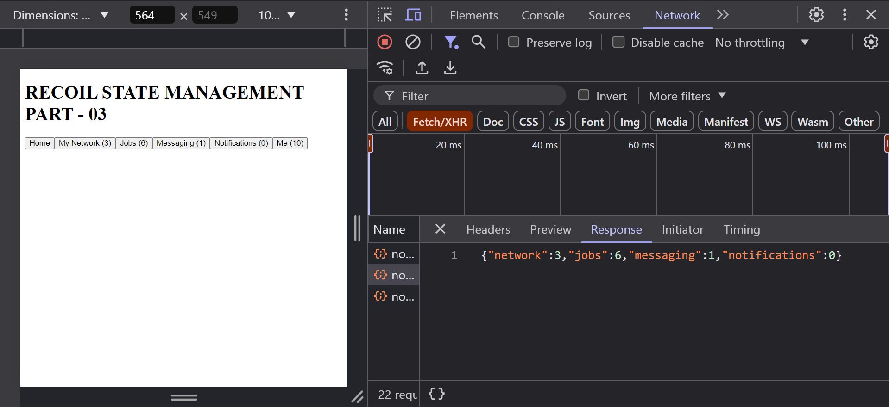

# Recoil State Management in React (Recoil Part 3)

## Asynchronous Data Queries

Asynchronous data queries are queries that fetch data from an external source, such as a server, database, or API.

## Implementing Asynchronous Data Queries ( Way 1 )

First create the simple `atom`:

```jsx
// RECOIL-STATE-MANAGEMENT/recoil-1/src/atoms.js
import { atom, selector } from "recoil";

export const notificationsAtom = atom({
  key: "networkAtom",
  default: {
    network: 4,
    jobs: 6,
    messaging: 3,
    notifications: 3,
  },
});

export const totalNotificationSelector = selector({
  key: "totalNotificationSelector",
  get: ({ get }) => {
    const {
      network,
      jobs,
      messaging,
      notifications: notificationss,
    } = get(notificationsAtom);
    return network + jobs + messaging + notificationss;
  },
});
```

Use the `atom` and `selector` in the `App` component:

```jsx
// RECOIL-STATE-MANAGEMENT/recoil-1/src/App.jsx
import {
  RecoilRoot as RecoilRootProvider,
  useRecoilState,
  useRecoilValue,
} from "recoil";
import { notificationsAtom, totalNotificationSelector } from "./atoms";
import { useEffect } from "react";
import axios from "axios";

const App = () => {
  return (
    <RecoilRootProvider>
      <MainApp />
    </RecoilRootProvider>
  );
};

const MainApp = () => {
  const [networkCount, setNetworkCount] = useRecoilState(notificationsAtom);
  const totalNotifications = useRecoilValue(totalNotificationSelector);

  const {
    network: networkValue,
    jobs: jobsValue,
    messaging: messagingValue,
    notifications: notificationsValue,
  } = networkCount;

  useEffect(() => {
    axios.get("http://localhost:3000/notifications").then((res) => {
      setNetworkCount(res.data);
    });
  }, [setNetworkCount]);

  return (
    <>
      <h1>RECOIL STATE MANAGEMENT PART - 03</h1>
      <div>
        <button>Home</button>

        <button>
          My Network ({networkValue >= 100 ? "99+" : networkValue})
        </button>
        <button>Jobs ({jobsValue})</button>
        <button>Messaging ({messagingValue})</button>
        <button>Notifications ({notificationsValue})</button>

        <button>Me ({totalNotifications})</button>
      </div>
    </>
  );
};

export default App;
```

## Screenshots



## Implementing Asynchronous Data Queries ( Way 2 )

Fisrt create the simple `atom`:

```jsx
// RECOIL-STATE-MANAGEMENT/recoil-1/src/atoms.js
import { atom, selector } from "recoil";
import axios from "axios";

// Notifications selector to fetch data (Asynchronous Data Query)
export const notificationsSelector = selector({
  key: "notificationsSelector",
  get: async () => {
    // Fetch data from the server
    const response = await axios.get("http://localhost:3000/notifications");
    return response.data;
  },
});

// Atom to hold notifications data
export const notificationsAtom = atom({
  key: "notificationsAtom",
  default: {
    network: 0,
    jobs: 0,
    messaging: 0,
    notifications: 0,
  },
});

// Selector to calculate total notifications
export const totalNotificationSelector = selector({
  key: "totalNotificationSelector",
  get: ({ get }) => {
    const {
      network,
      jobs,
      messaging,
      notifications: notificationss,
    } = get(notificationsAtom);
    return network + jobs + messaging + notificationss;
  },
});
```

Use the `atom` and `selector` in the `App` component:

```jsx
// RECOIL-STATE-MANAGEMENT/recoil-1/src/App.jsx
import { useEffect } from "react";
import {
  RecoilRoot as RecoilRootProvider,
  useRecoilState,
  useRecoilValue,
} from "recoil";
import {
  notificationsAtom,
  notificationsSelector,
  totalNotificationSelector,
} from "./atoms";

const App = () => {
  return (
    <RecoilRootProvider>
      <MainApp />
    </RecoilRootProvider>
  );
};

const MainApp = () => {
  const [networkCount, setNetworkCount] = useRecoilState(notificationsAtom);
  const totalNotifications = useRecoilValue(totalNotificationSelector);
  const fetchedNotifications = useRecoilValue(notificationsSelector);

  const {
    network: networkValue,
    jobs: jobsValue,
    messaging: messagingValue,
    notifications: notificationsValue,
  } = networkCount;

  // Set notifications only after the component has mounted
  useEffect(() => {
    // Set notifications
    if (fetchedNotifications) {
      setNetworkCount(fetchedNotifications);
    }
    // Return a cleanup function
    return () => {};
  }, [fetchedNotifications, setNetworkCount]);

  return (
    <>
      <h1>RECOIL STATE MANAGEMENT PART - 03</h1>
      <div>
        <button>Home</button>

        <button>
          My Network ({networkValue >= 100 ? "99+" : networkValue})
        </button>
        <button>Jobs ({jobsValue})</button>
        <button>Messaging ({messagingValue})</button>
        <button>Notifications ({notificationsValue})</button>

        <button>Me ({totalNotifications})</button>
      </div>
    </>
  );
};

export default App;
```

## Screenshots


