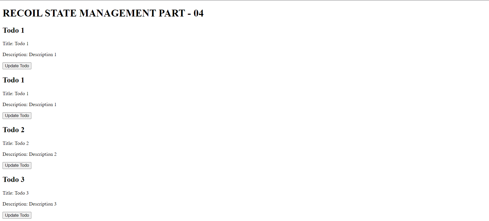
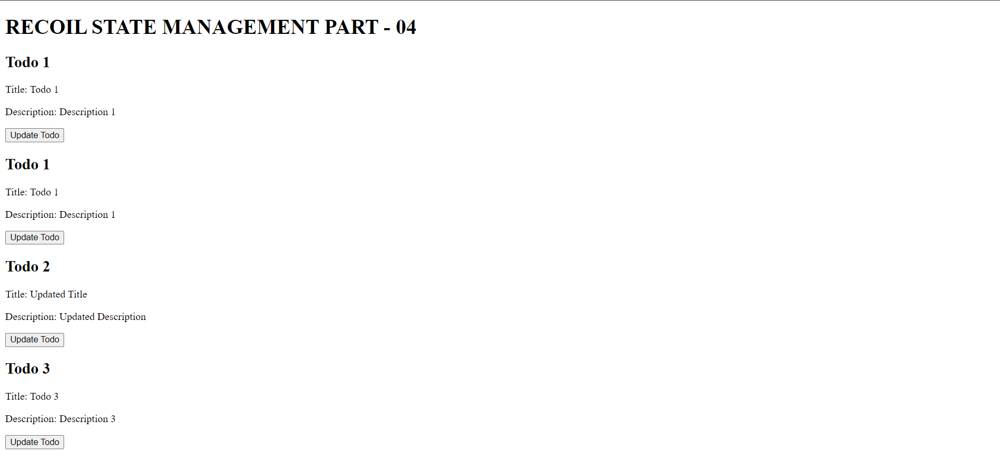

# Recoil State Management in React (Recoil Part 4)

## AtomFamily

AtomFamily is a way to create a family of atoms that share the same key but have different values. It is also used to create a family of atoms that share the same key but have different values.

**Problem:**
Some times we need more than one atom with the same key but different values for our use cases.

**For Example:**
Creating a todo list app, we need to create a todo atom for each todo item.

**Question:**
Create a component that takes a todo id as input and renders the todo item.

- We need to store the todo item in a todo atom with the todo id as the key. (Can't use useState)
- All todos can be hard coded as variables.

```jsx
// RECOIL-STATE-MANAGEMENT/recoil-1/src/todos.json
{
  "todo": [
    {
      "id": 1,
      "title": "Todo 1",
      "description": "Description 1"
    },
    {
      "id": 2,
      "title": "Todo 2",
      "description": "Description 2"
    },

    {
      "id": 3,
      "title": "Todo 3",
      "description": "Description 3"
    },
    {
      "id": 4,
      "title": "Todo 4",
      "description": "Description 4"
    }
  ]
}
```

```jsx
// RECOIL-STATE-MANAGEMENT/recoil-1/src/atoms.js
import { atomFamily } from "recoil";
import TODO from "./todos.json";

export const todoAtomFamily = atomFamily({
  key: "todoAtomFamily",
  default: (todoId) => TODO.todo.find((todo) => todo.id === todoId),
});
```

```jsx
// RECOIL-STATE-MANAGEMENT/recoil-1/src/App.jsx
import {
  RecoilRoot as RecoilRootProvider,
  useRecoilValue,
  useSetRecoilState,
} from "recoil";
import { todoAtomFamily } from "./atoms";

const App = () => {
  return (
    <RecoilRootProvider>
      <MainApp />
    </RecoilRootProvider>
  );
};

const MainApp = () => {
  return (
    <>
      <h1>RECOIL STATE MANAGEMENT PART - 04</h1>
      <Todo todoId={1} />
      <Todo todoId={1} />
      <Todo todoId={2} />
      <Todo todoId={3} />
    </>
  );
};

// Update the todo component
const UpdateTodo = ({ todoId }) => {
  const updateTodo = useSetRecoilState(todoAtomFamily(todoId));
  return (
    <button
      onClick={() =>
        updateTodo({
          id: todoId,
          title: "Updated Title",
          description: "Updated Description",
        })
      }
    >
      Update Todo
    </button>
  );
};

// Display the current todo component
const Todo = ({ todoId }) => {
  const currentTodo = useRecoilValue(todoAtomFamily(todoId));

  return (
    <div>
      <h2>Todo {currentTodo.id}</h2>
      <p>Title: {currentTodo.title}</p>
      <p>Description: {currentTodo.description}</p>
      <UpdateTodo todoId={todoId} />
    </div>
  );
};

export default App;
```

## Screenshots Before Update Todo 2



## Screenshots After Update Todo 2



## Conclusion

In this part, we learned how to create a family of atoms that share the same key but have different values.

For more information, please refer to the official documentation: https://recoiljs.org/docs/introduction/getting-started
