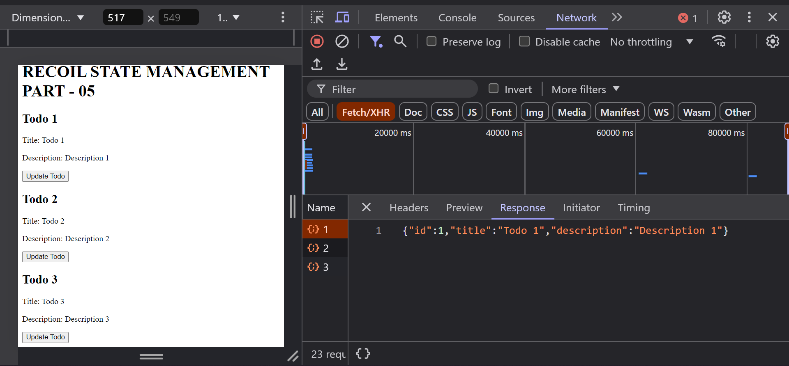

# Recoil State Management in React (Recoil Part 5)

## SelectorFamily

`selectorFamily` in Recoil is a feature that allows we to create parameterized selectors. This means we can define selectors that operate on specific pieces of state based on input parameters, making it easier to manage dynamic data.

**Problem:**
In the todo list app, lets say we are suppossed to get todos from the `server` based on a query parameter.

**For Example:**

```jsx
// RECOIL-STATE-MANAGEMENT/recoil-1/src/atoms.js
import { atomFamily, selectorFamily } from "recoil";
import axios from "axios";

export const todoAtomFamily = atomFamily({
  key: "todoAtomFamily",
  default: selectorFamily({
    key: "todoSelectorFamily",
    get: (id) => async () => {
      const response = await axios.get(`http://localhost:3000/todos/${id}`);
      return response.data;
    },
  }),
});
```

```jsx
// RECOIL-STATE-MANAGEMENT/recoil-1/src/App.jsx
import {
  RecoilRoot as RecoilRootProvider,
  useRecoilValue,
  useSetRecoilState,
} from "recoil";
import { todoAtomFamily } from "./atoms";

const App = () => {
  return (
    <RecoilRootProvider>
      <MainApp />
    </RecoilRootProvider>
  );
};

const MainApp = () => {
  return (
    <>
      <h1>RECOIL STATE MANAGEMENT PART - 05</h1>
      <Todo todoId={1} />
      <Todo todoId={2} />
      <Todo todoId={3} />
    </>
  );
};

// Update the todo component
const UpdateTodo = ({ todoId }) => {
  const updateTodo = useSetRecoilState(todoAtomFamily(todoId));
  return (
    <button
      onClick={() =>
        updateTodo({
          id: todoId,
          title: "Updated Title",
          description: "Updated Description",
        })
      }
    >
      Update Todo
    </button>
  );
};

// Display the current todo component
const Todo = ({ todoId }) => {
  const currentTodo = useRecoilValue(todoAtomFamily(todoId));

  return (
    <div>
      <h2>Todo {currentTodo.id}</h2>
      <p>Title: {currentTodo.title}</p>
      <p>Description: {currentTodo.description}</p>
      <UpdateTodo todoId={todoId} />
    </div>
  );
};

export default App;
```

## Screenshot



## Conclusion

In this part, we learn how to use `selectorFamily` to create parameterized selectors for Recoil.

For more information, check out the [Recoil documentation](https://recoiljs.org/docs/guides/selectorFamily).
