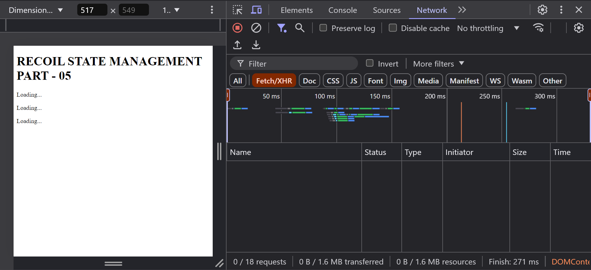
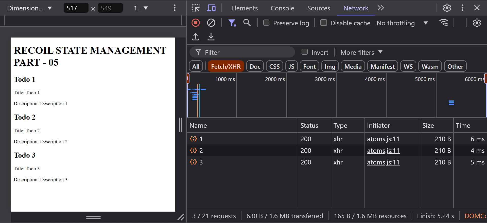

# Recoil State Management in React (Recoil Part 6)

## UseRecoilStateLoadable and UseRecoilValueLoadable

`useRecoilStateLoadable` and `useRecoilValueLoadable` are two hooks provided by the `recoil` library that allow us to manage the loading state of state values.

**Problem:**

- What happens when the values are not loaded immediately?

`For example`, The todos that are coming from the `server` are not loaded immediately, so we need to handle the loading state of the values.

- How can we show a loading indicator rather than empty state while the values are being loaded?

**For Example:**

```jsx
// RECOIL-STATE-MANAGEMENT/recoil-1/src/atoms.js
import { atomFamily, selectorFamily } from "recoil";
import axios from "axios";

export const todoAtomFamily = atomFamily({
  key: "todoAtomFamily",
  default: selectorFamily({
    key: "todoSelectorFamily",
    get: (id) => async () => {
      // Sleep for 5 second to simulate a network request (Testing Purposes)
      await new Promise((resolve) => setTimeout(resolve, 5000));

      const response = await axios.get(`http://localhost:3000/todos/${id}`);
      return response.data;
    },
  }),
});
```

```jsx
// RECOIL-STATE-MANAGEMENT/recoil-1/src/App.jsx
import {
  RecoilRoot as RecoilRootProvider,
  useRecoilStateLoadable,
} from "recoil";
import { todoAtomFamily } from "./atoms";

const App = () => {
  return (
    <RecoilRootProvider>
      <MainApp />
    </RecoilRootProvider>
  );
};

const MainApp = () => {
  return (
    <>
      <h1>RECOIL STATE MANAGEMENT PART - 05</h1>
      <Todo todoId={1} />
      <Todo todoId={2} />
      <Todo todoId={3} />
    </>
  );
};

// Display the current todo component
const Todo = ({ todoId }) => {
  const [currentTodo, setCurrentTodo] = useRecoilStateLoadable(
    todoAtomFamily(todoId)
  );

  // const currentTodo = useRecoilValueLoadable(todoAtomFamily(todoId));

  if (currentTodo.state === "loading") {
    return <p>Loading...</p>;
  }

  return (
    <div>
      <h2>Todo {currentTodo.contents.id}</h2>
      <p>Title: {currentTodo.contents.title}</p>
      <p>Description: {currentTodo.contents.description}</p>
    </div>
  );
};

export default App;
```

## Screenshot Before Loading



## Screenshot After Loading



## Conclusion

In this part, we learned how to use the `useRecoilStateLoadable` and `useRecoilValueLoadable` hooks to manage the loading state of state values.

Follow the documentation for more information: [https://recoiljs.org/docs/introduction/installation](https://recoiljs.org/docs/introduction/installation)
